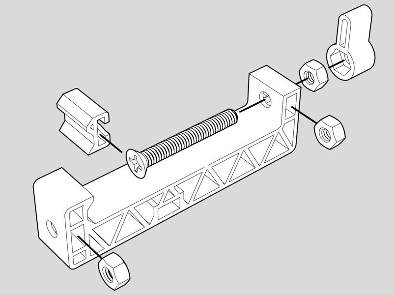

# Open Chess Clock

Open Chess Clock is a completely open-source chess/game clock consisting of
both off-the-shelf and 3D-printed parts. The goals of this project are to
create a chess clock that

- is easy and intuitive to set.
- supports multiple time control modes.
- doesn't become a brick if the vendor goes out of business.
- enables the use of clocks with n-player games.
- is inexpensive and accessible.
- is completely customizable.

The first version of this clock is powered by [Chess.com's Android chess clock
app](https://github.com/ChessCom/android-chessclock), which is licensed under
MPL-2.0. This app will likely be replaced in version 2 in order to allow
pairing two devices in order to play 4-player games and chess variants with
time controls.


## Feature status
| Feature | Status |
| --- | --- |
| Basic time control | ✅ |
| Incremental/Fischer mode | ✅ |
| Bronstein delay | ✅ |
| Simple delay | ✅ |
| 2-player support | ✅ |
| 4-player support | ❌ |
| n-player support | ❌ |
| Android support | ✅ |
| iPhone support | ❌ |

## BOM
### 3D-printed parts
<!-- Add estimated print time -->
| Name | Material | Quantity |
| --- | --- | --- |
| Clock base | PLA | 1 |
| Clock lid | PLA | 1 |
| Phone clamp base | PLA | 1 |
| Phone clamp jaw | PLA | 1 |
| Phone clamp handle | PLA | 1 |
| Phone clamp nut plug (optional) | PLA | 1 |
| Strain relief insert | TPU | 1 |

### Off-the-shelf parts
| Name | Quantity |
| --- | --- |
| 1/4-20 x 2" flat head machine screw | 1 |
| 1/4-20 x 1/2" round/truss head machine screw | 1 |
| 1/4-20 nut | 3 |
| 2.54mm right-angle male header pins | 4 |
| 2.54mm 18-24 AWG female crimp connector | 4 |
| 4-pin dupont connector housing | 1 |
| 6" USB-C to USB-C cable| 1 |
| #8-32 x 1/2" truss head machine screw | 1 |
| #8-32 nut | 1 |
| 22 AWG stranded wire | 44 cm |
| Adhesive silicone/rubber self-adhesive sheet | 9cm x 16cm |
| Android phone | 1 |
| Arduino Pro Micro-compatible microcontroller (USB-C) | 1 |
| Cherry MX-compatible keycap | 2 |
| Cherry MX-compatible switch | 2 |
| Cherry-compatible heavy-spring (optional) | 2 |

## Build instructions

### 1. Print the 3D-printed parts

Print the 3D-printed parts specified in the [BOM](#3d-printed-parts). Slicer
settings for Ultimaker Cura are included in the 3MF files for each part, but
here are some guidelines:

#### Clock base and lid

- Build plate adhesion: Skirt
- Cooling: 0%
- Infill density: 50%
- Layer height: 0.2mm
- Material: PLA
- Supports: Yes
- Support density: 10%

#### Phone clamp

- Build plate adhesion: Brim
- Cooling: 0%
- Infill density: 100%
- Layer height: 0.28mm
- Material: PLA
- Supports: No

#### Strain relief insert

- Build plate adhesion: Skirt
- Cooling: 100%
- Infill density: 25%
- Infill pattern: Gyroid
- Layer height: 0.2mm
- Material: TPU
- Supports: No

### 2. Remove the supports

Remove the supports from the clock base and lid. Pay special attention to the
slot where the microcontroller will be mounted. If the supports are too
difficult to remove, you may need to adjust your slicer settings.

### 3. Install the wiring

#### 3a. Cut the wires to length

Cut the wires to the following lengths:

- Black (left switch ground): 9cm
- White: 9cm
- Black (right switch ground): 13cm
- Red: 13cm

#### 3b. Install the wires in the wiring channels
Line each wire up with its corresponding slot and note where the switch pins
protrude into the wiring channel. Shave a bit of the insulation from the side
of the wire in order to expose the inner strands so that the switch pins can
make good contact.

Press each wire into its corresponding slot, lining up the switch pins with the
exposed wire. Run the wires up into the base through the cutout in the bottom.

#### 3c. Install the dupont connector

Crimp a 2.54mm 18-24 AWG female crimp connector onto the end of each wire. Plug
the wires into a 4-pin dupont connector housing. The order of the wires from
left to right is white, red, black, black.

### 4. Install the switches

Press the switches into the switch sockets on the clock base. Using an
electrical circuit tester, verify that the switches are making good contact
with the wiring by testing for a closed circuit between the data and ground
wires when each switch is pressed.

### 5. Install the microcontroller

#### 5a. Solder the header pins

Solder the right-angle header pins into the microcontroller's pin holes. Use
the two ground pins, pin 2, and pin 3.

#### 5b. Load the sketch

Using the Arduino IDE, load the [chess-clock.ino](./chess-clock.ino) sketch
onto the microcontroller.

#### 5c. Mount the microcontroller

Slide the microcontroller into the slot in the clock base until it is firmly
seated. The slot should be snug enough to retain the microcontroller, but the
USB cable and strain relief insert will secure it in place.

#### 5d. Install the USB cable

Pass the USB cable and one side of the strain relief insert through the USB
cable channel in the clock base. The hole in the strain relief insert is
slightly off-center in the vertical direction and should align with the USB
port.

Plug the cable into the microcontroller. Press the other side of the strain
relief insert into place. It should fit snugly.

Now is a good time to test the clock by plugging the USB cable into the Android
device and opening the Chess.com chess clock app. If the buttons do not
properly control the clock, please see the [troubleshooting](#troubleshooting) section.

### 6. Assemble the phone clamp



Slide one nut into the phone clamp base where it will attach to the clock lid.
If the phone clamp nut plug has been printed, press it into the slot following
the nut to secure the nut in place.

Snap the jaw onto the head of the screw. Slide one nut into the top of the
phone clamp base. Push the screw through the top holes of the phone clamp base
and thread it through the nut until it protrudes completely from the top of the phone clamp base.

Thread a third nut onto the screw until 5mm of screw protrudes from the nut.
Using super glue or other appropriate adhesive, glue the nut and screw into the
handle.

### 7. Assemble the clock

#### 7a. Attach the phone clamp to the lid

Using a 1/4-20 x 1/2" round/truss head machine screw, attach the phone clamp to
the clock lid.

#### 7b. Attach the lid to the base.

Put the lid onto the base, aligning the screw holes. Place a #8-32 nut into
shaft in the clock base. Thread the #8-32 x 1/2" truss head machine screw
through the hole in the clock lid and into the nut in the clock base.

### 8. Install the phone

#### 8a. Install the Chess.com Chess Clock app

Install the [Chess.com Chess Clock
app](https://play.google.com/store/apps/details?id=com.chess.clock&hl=en_US)
from the Google Play Store.

#### 8b. Clamp the phone in place and test

Place the phone into the phone clamp and tighten gently until the phone is
secure. Plug the USB cable into the phone. Open the Chess Clock app and test.
If the buttons do not control the clock, please see the
[troubleshooting](#Troubleshooting) section.

### 9. Install anti-slip material

Using a self-adhesive, anti-slip sheet of rubber, silicone, or similar
material, stick the bottom of the clock base to the material. Using a sharp
utility knife, carefully trim the excess material from the edges of the base.

NOTE: Do not do this step until you are sure that the wiring is properly
installed and the clock works as intended.


## Troubleshooting

### The microcontroller does not power on when plugged into the phone

When the microcontroller is plugged into the phone, LEDs on the microcontroller
should light up. If the microcontroller is already installed into the clock
base, you'll see these lights reflecting off of the bottom of the base.

On some Android devices, the mirocontroller will only be recognized if the
USB-C cable is oriented in a specific way. This can vary depending on the specific
Android device, microcontroller, and USB cable that are used. Try rotating the
USB-C cable 180 degrees in the microcontroller's port and/or the Android
device's port.

### The microcontroller powers on but does not control the clock

#### Check the wiring

Using an electrical circuit tester, verify that the switches are making good
contact with the wiring by testing for a closed circuit between the data and
ground wires when each switch is pressed. Perform the same test on the pins of
the microcontroller to check that the solder joints are making good contact.
When the left switch is pressed, the tester should indicate a closed circuit
between pin 3 and both ground pins. When the right switch is pressed, the
tester should indicate a closed circuit between pin 2 and both ground pins.

#### Test the keyboard functionality

Modify the [chess-clock.ion](./chess-clock.ino) sketch to press ASCII keys
instead of the clock control keystrokes. Plug the microcontroller into the
phone. Select any app/field that expects text as input. Press the left switch
and verify that the letter 'a' is typed. Press the right switch and verify that
the letter 'b' is typed. If neither letter is typed, connect the
microcontroller to a computer and try the same test.

```diff
diff --git a/chess-clock.ino b/chess-clock.ino
index 807be7b..8403ec3 100644
--- a/chess-clock.ino
+++ b/chess-clock.ino
@@ -13,9 +13,9 @@ const int RIGHT_DOWN = 5;

 int current_state = IDLE;

-const int LEFT_KEY_SEQUENCE[] = {KEY_DOWN_ARROW, KEY_DOWN_ARROW, KEY_LEFT_ARROW, KEY_RETURN};
+const int LEFT_KEY_SEQUENCE[] = {'a'};
 const int LEFT_KEY_SEQUENCE_SIZE = sizeof(LEFT_KEY_SEQUENCE) / sizeof(LEFT_KEY_SEQUENCE[0]);
-const int RIGHT_KEY_SEQUENCE[] = {KEY_DOWN_ARROW, KEY_DOWN_ARROW, KEY_RIGHT_ARROW, KEY_RETURN};
+const int RIGHT_KEY_SEQUENCE[] = {'b'};
 const int RIGHT_KEY_SEQUENCE_SIZE = sizeof(RIGHT_KEY_SEQUENCE) / sizeof(RIGHT_KEY_SEQUENCE[0]);

 void setup() {
```


## Acknowledgements

Thanks to [pixel2](https://www.printables.com/@pixel2_237985) for the
[3D-printed phone
clamp](https://www.printables.com/model/233032-phone-clamp-for-tripod/files).

Thanks to [Chess.com] for the Android chess clock app.
